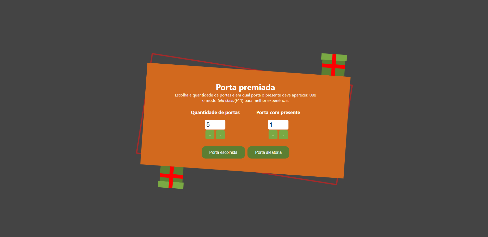
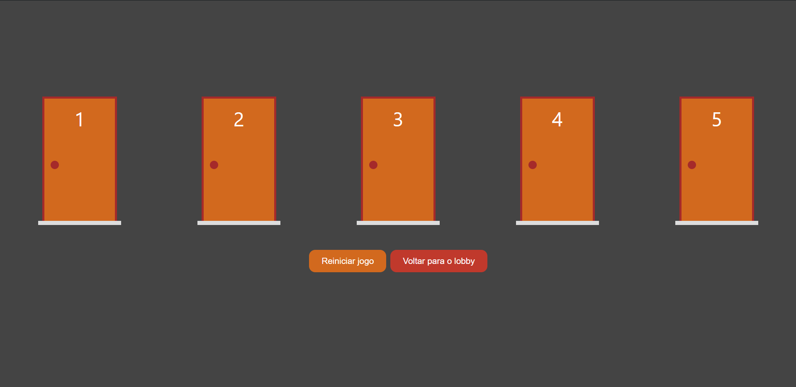

# Porta Premiada
Porta premiada é um jogo simples em que, para ganhar, o jogador precisa acertar qual porta está o presente. Esse projeto foi desenvolvido apenas para treinamento pessoal, com base no curso "Next.js & React" da Cod3r.

O jogo oferece a opção de escolher quantas portas terá e em qual vai estar o presente, também é possível jogar no modo aleatório. 

Deploy do projeto: https://porta-premiada.vercel.app/

Para utilizar o programa use: 

```
git clone https://github.com/viniciuslima21/portaPremiada.git
```

## Tecnologias utilizadas
* Html
* CSS
* JavaScript
* ReactJs
* NextJs
* Typescript

## Imagens do projeto


